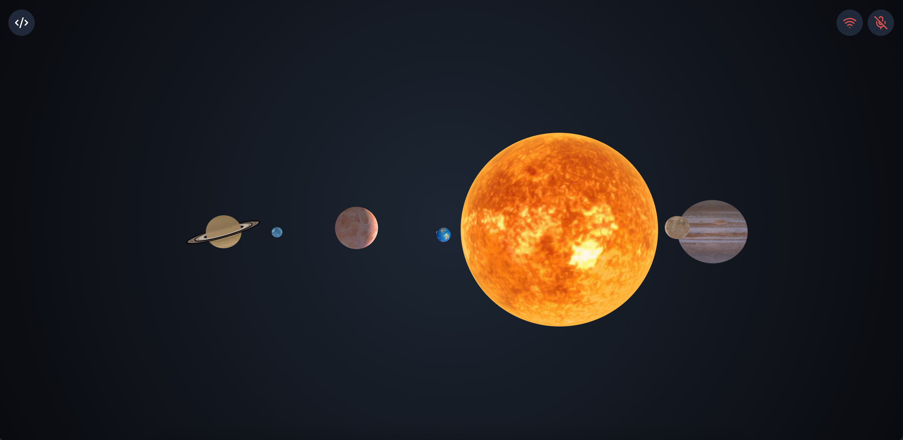

# Realtime Solar System Demo

[](LICENSE)


This demo showcases how to use the [OpenAI Realtime API](https://platform.openai.com/docs/guides/realtime) to interact through voice with a 3D scene (built with [Spline](https://spline.design/)), in this case a scene representing the solar system.

It is implemented using the [Realtime + WebRTC integration](https://platform.openai.com/docs/guides/realtime-webrtc) and uses [Function Calling](https://platform.openai.com/docs/guides/realtime-model-capabilities#function-calling) to trigger actions in the app.



## How to use

### Running the application

1. **Set up the OpenAI API:**

   - If you're new to the OpenAI API, [sign up for an account](https://platform.openai.com/signup).
   - Follow the [Quickstart](https://platform.openai.com/docs/quickstart) to retrieve your API key.

2. **Set up TURN server (optional but recommended):**

   - Sign up for a free account with a TURN server provider like [Metered](https://www.metered.ca/)
   - Create a new app and get your TURN API key
   - Add these to your `.env` file:
     ```bash
     TURN_DOMAIN=yourappname.metered.live
     TURN_API_KEY=your-turn-api-key
     ```

3. **Clone the Repository:**

   ```bash
   git clone https://github.com/openai/openai-realtime-solar-system.git
   ```

4. **Set up the FastAPI backend:**

   - Navigate to the `fastapi-backend` directory
   - Create a virtual environment (recommended):
     ```bash
     python -m venv venv
     source venv/bin/activate  # On Windows, use: venv\Scripts\activate
     ```
   - Install dependencies:
     ```bash
     pip install -r requirements.txt
     ```
   - Copy the example environment file and update with your OpenAI API key:
     ```bash
     cp .env.example .env
     ```
   - Start the FastAPI server:
     ```bash
     python main.py
     ```
   - The backend will be available at http://localhost:8000

5. **Set up the frontend:**

   - Create a `.env` file at the root of the project with the following:
     ```bash
     # Only needed if not using FastAPI backend
     OPENAI_API_KEY=<your_api_key>
     
     # TURN server configuration (optional but recommended)
     TURN_DOMAIN=yourappname.metered.live
     TURN_API_KEY=your-turn-api-key
     
     # FastAPI backend
     API_HOST=http://localhost:8000
     ```

6. **Install frontend dependencies:**

   Navigate to the project root directory and run:

   ```bash
   npm install
   ```

7. **Run the frontend app:**

   ```bash
   npm run dev
   ```

   The app will be available at [http://localhost:3000](http://localhost:3000).

**Note:** the 1st time you load the app, the scene can take a while to load (it's heavy!). The subsequent loads should be faster as it will be cached.

### Starting a session

To start a new Realtime session, wait for a few seconds for the page to load properly, thenclick on the wifi icon in the top right corner of the app.
Once it turns green, you can start talking to the model.

You can use the mic icon right next to it to toggle the microphone on and off. When you start the session, it will automatically turn on, but you can turn it off to mute yourself while the session is running.

Toggling the wifi icon will stop the session, and the conversation will be reset.

## Demo flow

**Make sure there is no background noise or echo when you talk to the model, as this may cause interruptions.**

The demo is configured with instructions prompting the model to answer any question about the solar system. Additionally, the model has access to multiple tools that map to actions in the app or animations in the spline scene.

### Configured interactions

More specifically, the following interactions trigger animations:

🪐 Asking about a **specific planet** will trigger a visual focus on that planet if the animation was set up in the spline scene (works with the Sun, Earth, Mercury, Mars, Jupiter, Saturn, Neptune, Pluto). These animations can also be triggered by clicking on the planets in the UI.

🌕 Asking about **moons** will trigger the moons to appear if they have been set up in the spline scene (works with Pluto's moons and Jupiter's galilean moons).

📊 Asking about **data** that can be represented with a chart will result in a chart being displayed in the UI (bar chart or pie chart).

🛰️ Asking about the position of the **ISS** will result in the ISS position being fetched and the ISS being displayed in the spline scene with the corresponding animation.

👋 Saying something like "thank you, I'm good" or anything to **close the conversation** will reset the camera to the initial position. This animation can also be triggered by hitting the space bar.

🌌 Asking about the planets' **orbits** will result in a camera change to see the solar system from above. This animation can also be triggered by hitting the M key to change to orbit view, and pressing the Enter key to change back to main view.

For more details about tools used by the model, see the `lib/config.ts` file.

### Example flow

Here is an example flow that showcases the different interactions:

1. Say something like "I'm curious about Earth" to focus on Earth
2. Ask for the distribution of land vs water - a pie chart should appear, if not prompt the model to show it to you
3. Say something like "I have a question about Mars now" to focus on Mars
4. Ask for the highest volcano and how it compares to Mount Everest - a bar chart should appear, if not prompt the model to show it to you
5. Say something like "thank you, I'm good" to reset the camera
6. Ask where the ISS is - the model should reply with the position and the ISS should appear in the scene
7. Say that you'd like to see Pluto now to focus on Pluto
8. Ask about its moons - 5 moons will pop up
9. (optional): Do the same with Jupiter and ask about Galilean moons - 4 moons will pop up
10. Ask something related to the position of the planets in the solar system, for example "how are the planets positioned in their orbits" - The view will change to a high level view with orbits

## Network Configuration and TURN Server

This application uses WebRTC to establish a connection with OpenAI's Realtime API. By default, WebRTC attempts to establish a direct peer-to-peer connection, which may not work in all network environments due to firewalls, NATs, or proxies.

To address this, the application now supports using a TURN (Traversal Using Relays around NAT) server to relay the WebRTC traffic when a direct connection is not possible. This significantly improves connection reliability, especially in restrictive network environments.

The application automatically fetches the optimal TURN servers based on your location from the configured TURN service provider. No additional configuration is needed once the TURN credentials are set in the `.env` file.

## Architecture

The application consists of two main parts:

1. **FastAPI Backend**: Handles secure communication with OpenAI's API. It fetches ephemeral session tokens that are used to establish WebRTC connections. This separation ensures API keys are not exposed to the client.

2. **Next.js Frontend**: Provides the user interface and manages the WebRTC connection to OpenAI's Realtime API. It communicates with the FastAPI backend to get session tokens and with the TURN server to facilitate WebRTC connections.

## Customization

This demo is just an example of how to use Function Calling with the Realtime API to trigger actions in an application, including sending events to a spline scene.

You can read more about how to build your own scene in the [Spline documentation](https://docs.spline.design/doc). You can then change the scene url in the `components/scene.tsx` file.

```html
<Spline
  scene="https://prod.spline.design/<scene_id>/scene.splinecode"
  onLoad="{onLoad}"
/>
```

If you want to use your own scene, make sure to configure trigger events in the spline scene, and update the code to trigger the events in the `components/scene.tsx` file.

For example, you can add to any object in your scene a `mouseDown` event that will trigger an animation. You can then trigger this event in the `components/scene.tsx` file by calling `spline.current.emitEvent("mouseDown", "object_name")`.

You can also update:

- The instructions in the `lib/config.ts` file to change the behavior of the model
- The tools the model has access to in the `lib/config.ts` file
- The [voice](https://platform.openai.com/docs/api-reference/realtime-sessions/create#realtime-sessions-create-voice) in the `lib/constants.ts` file

## License

This project is licensed under the MIT License. See the LICENSE file for details.
